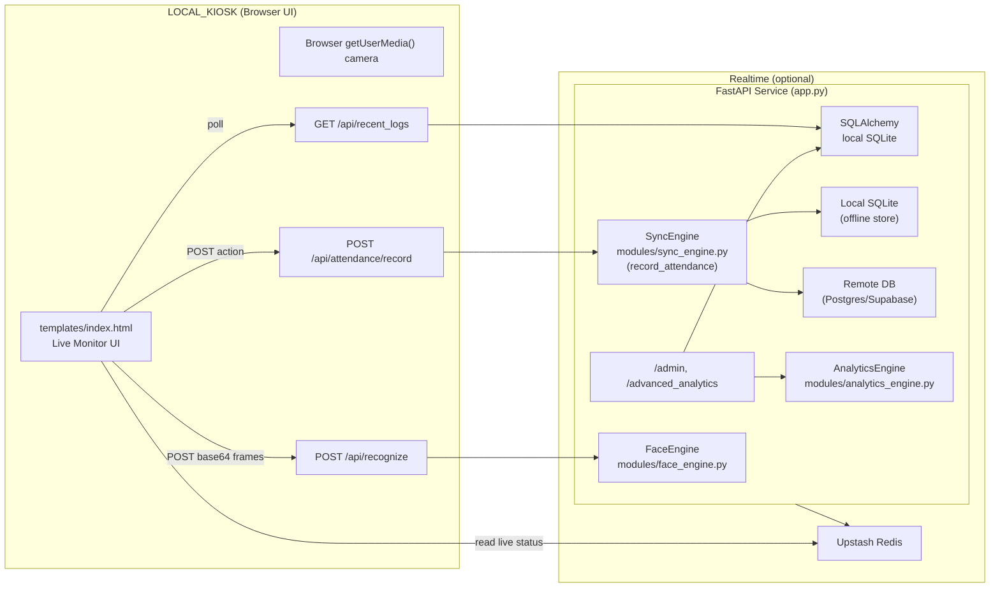

# CVIAAR — Comprehensive Technical Documentation

This document is the primary, version-controlled reference for both developers and end users of the CVIAAR system. It covers architecture, setup, operational workflows, and a detailed API reference.

## 1) System Overview

CVIAAR is a kiosk-style attendance system built around:

- **Real-time face recognition** (OpenCV LBPH) and **liveness detection** (MediaPipe Face Mesh + blink detection).
- **Offline-first recording** to local SQLite with background **sync** to a remote database (Supabase / Postgres).
- **Admin dashboard** for analytics, user management, audit logs, exports, and retraining.
- **Staff portal** for viewing personal logs and requesting emailed reports.

### 1.1 Runtime Roles

The app supports two conceptual roles:

- **LOCAL_KIOSK**: Runs camera capture + recognition + attendance recording.
- **ADMIN_DASHBOARD**: Runs admin UI and analytics (no camera pipeline).

Role is controlled by environment variables and settings loaded from [.env](file:///c:/Users/keith/Downloads/projectCVI3/.env) via [config.py](file:///c:/Users/keith/Downloads/projectCVI3/config.py).

## 2) Architecture

### 2.1 High-Level Component Diagram



### 2.2 Data Flow Summary

1. Browser captures camera frames and POSTs them to `/api/recognize`.
2. Backend uses MediaPipe FaceMesh for face/bbox + blink detection, then LBPH to classify.
3. If the face is verified (blink within TTL), the UI allows Log in/Log out.
4. Attendance records are stored locally via `SyncEngine.record_attendance(...)`.
5. Background sync worker uploads pending records to remote DB when network is available.

## 3) Repository Structure

- [app.py](file:///c:/Users/keith/Downloads/projectCVI3/app.py): FastAPI application, routes, session/flash middleware, camera/recognition integration, email sending, CSV export.
- [config.py](file:///c:/Users/keith/Downloads/projectCVI3/config.py): Pydantic settings (loads `.env`).
- [modules/models.py](file:///c:/Users/keith/Downloads/projectCVI3/modules/models.py): SQLAlchemy models.
- [modules/face_engine.py](file:///c:/Users/keith/Downloads/projectCVI3/modules/face_engine.py): MediaPipe FaceMesh + blink detection + LBPH prediction + training.
- [modules/sync_engine.py](file:///c:/Users/keith/Downloads/projectCVI3/modules/sync_engine.py): Offline-first recorder + sync worker to remote DB.
- [modules/analytics_engine.py](file:///c:/Users/keith/Downloads/projectCVI3/modules/analytics_engine.py): Analytics computations (trends, risk, peak arrivals, distributions).
- [templates/](file:///c:/Users/keith/Downloads/projectCVI3/templates): Server-rendered UI pages (monitor, admin, staff portal, reports).
- [static/](file:///c:/Users/keith/Downloads/projectCVI3/static): Vendor assets (Bootstrap, D3).
- [Dockerfile](file:///c:/Users/keith/Downloads/projectCVI3/Dockerfile), [docker-compose.yml](file:///c:/Users/keith/Downloads/projectCVI3/docker-compose.yml): Containerization and runtime configuration.

## 4) Configuration (Environment Variables)

Settings load from `.env` (see [config.py](file:///c:/Users/keith/Downloads/projectCVI3/config.py)).

### 4.1 Required / Common

- `SECRET_KEY`: Session signing key (required for admin sessions and flash messages).
- `APP_ROLE`: `"LOCAL_KIOSK"` or `"ADMIN_DASHBOARD"` (defaults to `"LOCAL_KIOSK"` in code).
- `DEVICE_ID`: Identifier used by the sync engine for tracking device-originated records.

### 4.2 Database

- `SQLITE_DB_PATH`: Path to local SQLite file (offline store).
- `DATABASE_URL`: Remote Postgres URL (preferred for direct DB syncing).
- `SUPABASE_URL`, `SUPABASE_KEY`: Used for Supabase REST fallback in sync.

### 4.3 Redis (Optional)

- `UPSTASH_REDIS_URL`, `UPSTASH_REDIS_TOKEN`: Enables real-time status broadcasting.

### 4.4 Email (Gmail SMTP)

- `MAIL_USERNAME`: Gmail address sending reports.
- `MAIL_APP_PASSWORD`: 16-char Gmail App Password (not your normal password).

### 4.5 Recognition Tunables

These are read at runtime from environment variables (see [app.py](file:///c:/Users/keith/Downloads/projectCVI3/app.py)):

- `LBPH_DISTANCE_THRESHOLD` (default `50.0`): Lower = stricter recognition (fewer false positives).
- `VERIFIED_TTL_SEC` (default `6.0`): How long a blink verification remains valid.
- `MIN_FACE_SIZE_PX` (default `90`): Ignore tiny/far faces to reduce mislabeling.
- `RECOGNITION_STREAK_REQUIRED` (default `2`): Required consecutive matches before accepting a label.
- `RECOGNITION_STREAK_TIMEOUT_SEC` (default `1.0`): Time window for streak accumulation.

## 5) Setup Guide (Developers)

### 5.1 Docker (Recommended)

1. Create `.env` (based on your deployment environment).
2. Build and run:

```bash
docker-compose up --build
```

Service runs on `http://localhost:5000`.

### 5.2 Local (Without Docker)

1. Create and activate a Python 3.10 virtualenv.
2. Install dependencies:

```bash
pip install -r requirements.txt
```

3. Run:

```bash
uvicorn app:app --host 0.0.0.0 --port 5000
```

## 6) User Manual (End Users)

### 6.1 Live Monitor (Kiosk)

Page: `/` (LOCAL_KIOSK)

Workflow:
1. Stand in front of the camera.
2. If recognized, blink to verify.
3. Press **Log in** or **Log out**.
4. Recent activity updates in the sidebar.

Notes:
- If the system shows **PLEASE HOLD STILL**, stay steady for a moment to stabilize recognition.
- If unrecognized, use **Retrain Identity** to re-capture face data.

### 6.2 Admin Dashboard

Page: `/admin` (requires admin session)

Admin actions:
- Add users (Gmail registration).
- Delete users.
- Retrain recognition model.
- View recent logs, trends, predicted risk users.
- Export attendance to CSV.

### 6.3 Staff Portal

Page: `/staff_portal`

Staff actions:
- Enter Staff ID to view personal attendance history.
- Request an email report (Early Report) via Gmail.

## 7) API Documentation (OpenAPI + Route Reference)

### 7.1 OpenAPI / Swagger UI (Industry Standard)

FastAPI automatically publishes:

- **Swagger UI**: `GET /docs`
- **OpenAPI JSON**: `GET /openapi.json`

These endpoints provide a machine-readable spec suitable for tooling and client generation.

### 7.2 Route Reference (app.py)

Auth notes:
- Admin routes require a session set by `POST /login`.
- Kiosk recognition/recording routes require `APP_ROLE=LOCAL_KIOSK`.

#### Web Pages

- `GET /`: Live Monitor (or redirect to `/admin` when in ADMIN mode).
- `GET /login`: Login page.
- `POST /login`: Establishes admin session.
- `GET /logout`: Clears admin session.
- `GET /admin`: Admin dashboard (requires admin).
- `GET /advanced_analytics`: Advanced analytics UI (requires admin).
- `GET /audit_logs`: Audit log UI (requires admin).
- `GET /staff_portal`: Staff portal page.
- `POST /staff_portal`: Loads a staff member’s recent logs.
- `GET /enroll/{user_id}`: Enrollment page (admin).
- `GET /re_enroll`: User selection for re-enrollment (admin).
- `POST /re_enroll`: Redirects to enrollment flow.

#### Kiosk / Recognition APIs

- `POST /api/recognize`
  - Request: `{ "image": "data:image/jpeg;base64,..." }`
  - Response: `{ status: "success", faces: [{ rect, name, status, verified, user_id, blink_detected, confidence? }] }`

- `POST /api/attendance/record`
  - Request: `{ "user_id": number, "action": "login" | "logout" }`
  - Enforces liveness verification window and a cooldown to prevent rapid duplicate actions.

- `POST /api/capture/{user_id}`
  - Used during enrollment to capture face images.

- `POST /api/reset_faces/{user_id}`
  - Clears a user’s stored face images (re-enroll support).

#### Analytics / Data APIs

- `GET /analytics`: Summary stats and weekly trends (used by admin dashboard).
- `GET /api/advanced_analytics_data`: Detailed analytics slices for advanced analytics UI.
- `GET /api/recent_logs`: Recent attendance logs for the Live Monitor sidebar.
- `GET /export_attendance_csv`: Download CSV export (admin).

#### Reports / Email

- `POST /request_early_report`: Sends a styled HTML report email for a staff member.

#### Maintenance

- `GET|POST /retrain`: Triggers model retraining (admin).
- `POST /api/train`: Triggers background model retraining (admin).
- `POST /delete_user/{user_id}`: Deletes user + attendance + face data (admin).

## 8) Deployment Procedures

### 8.1 Docker Deployment

- Use [Dockerfile](file:///c:/Users/keith/Downloads/projectCVI3/Dockerfile) and [docker-compose.yml](file:///c:/Users/keith/Downloads/projectCVI3/docker-compose.yml).
- Persist `./data` volume for:
  - Face image datasets
  - Local SQLite DB
  - LBPH model file

### 8.2 Timezone Consistency

If timestamps are off in containerized deployments, ensure the container timezone is set (see [docker-compose.yml](file:///c:/Users/keith/Downloads/projectCVI3/docker-compose.yml)).

## 9) Troubleshooting

### 9.1 Camera Issues

- Browser permissions: allow camera access for `http://localhost:5000`.
- If Docker logs show camera device errors, note the kiosk UI uses browser camera (not container `/dev/video0`).

### 9.2 Misrecognition / “Confused” Recognition

- Increase `MIN_FACE_SIZE_PX` to ignore far faces.
- Increase `RECOGNITION_STREAK_REQUIRED` to require more stable matches.
- Lower `LBPH_DISTANCE_THRESHOLD` to reduce false positives.
- Retrain the model after adding many new users.

### 9.3 Gmail SMTP Authentication Errors

- Use a Gmail App Password (16 characters), not your account password.
- Ensure `.env` uses `MAIL_USERNAME` and `MAIL_APP_PASSWORD`.

### 9.4 Supabase / Remote Sync Problems

- Prefer setting `DATABASE_URL` (direct Postgres connection).
- Verify network connectivity and Supabase credentials.

## 10) Contribution Guidelines

### 10.1 Branching & PRs

- Use feature branches (e.g., `feature/csv-export`, `fix/recognition-stability`).
- Keep PRs focused; include reproduction steps and screenshots for UI changes.

### 10.2 Coding Standards

- Prefer docstrings for public functions/classes.
- Avoid hardcoding secrets; use `.env`.
- Keep recognition changes measurable: adjust thresholds via env tunables.

### 10.3 Testing

- Validate syntax: `python -m py_compile app.py`
- Validate core flows:
  - Live Monitor recognize → verify → record attendance
  - Admin CSV export
  - Staff portal report email

## 11) Glossary

- **LBPH**: Local Binary Patterns Histograms, a classical face recognition algorithm.
- **EAR**: Eye Aspect Ratio, used to detect blinks for liveness verification.
- **TTL**: Time-to-live window (seconds) for verification caching.
- **Offline-first**: Always writes locally first; syncs later when network is available.

